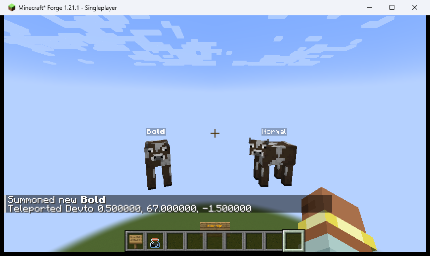
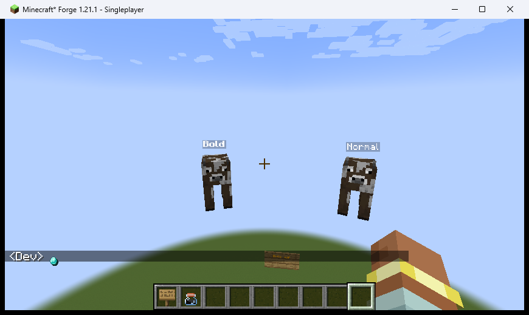
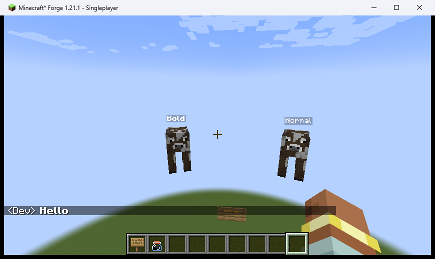
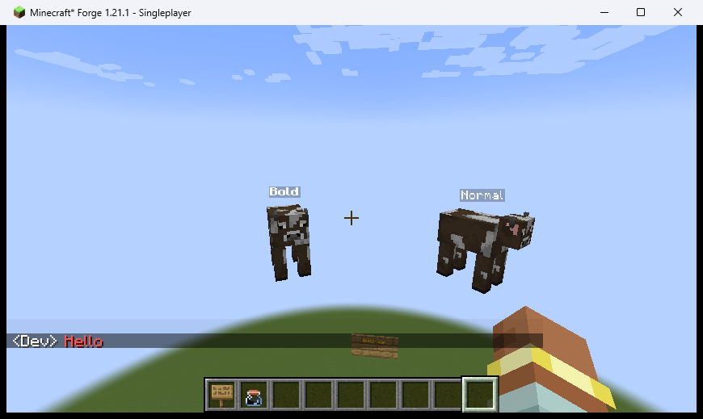
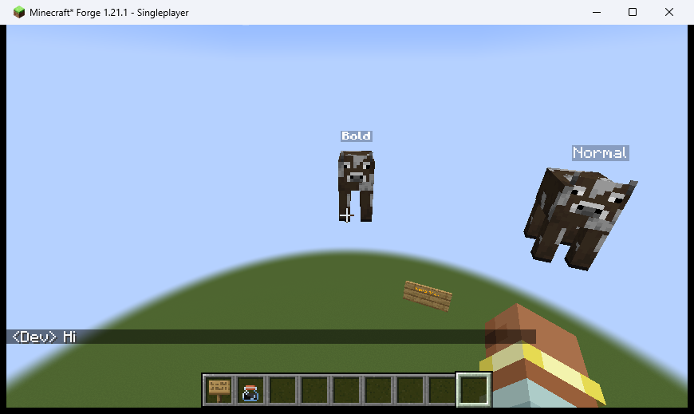
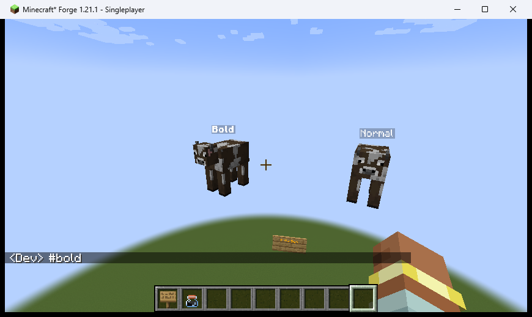
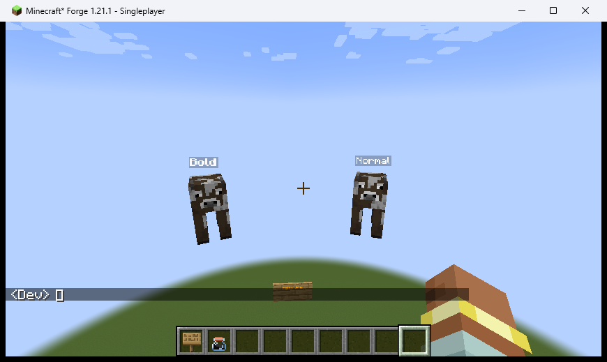
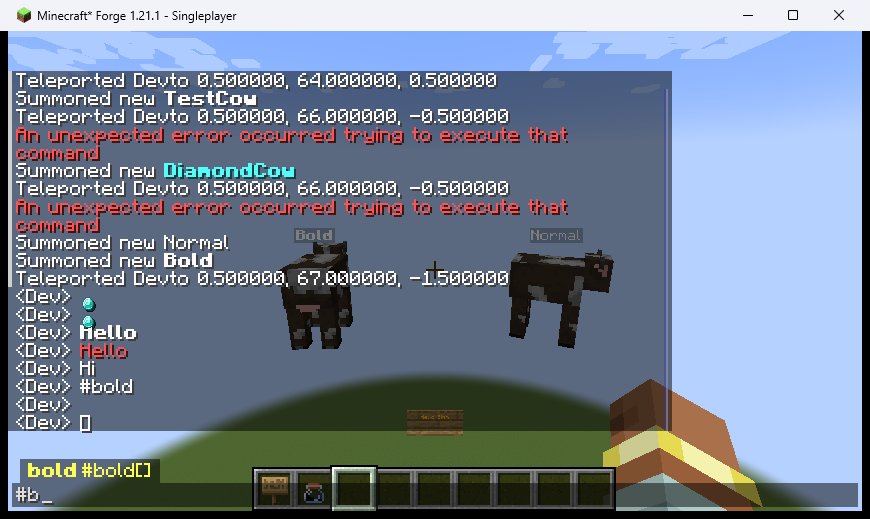
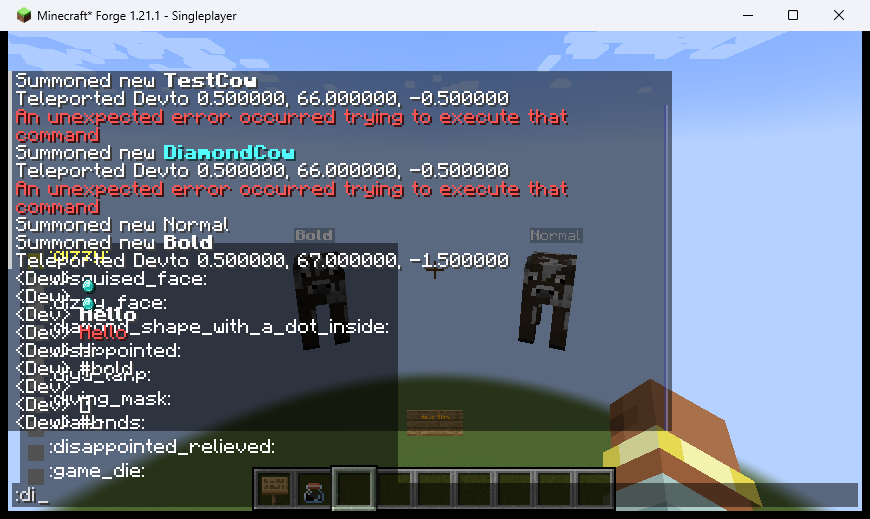
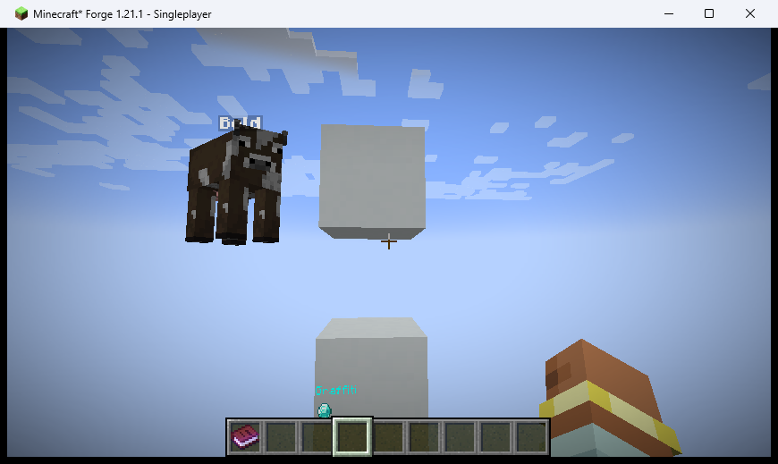

# QA Evidence — 2026-05-17

**ブランチ**: 1.21.1  
**コミット**: 836952c  
**Minecraft / Forge**: 1.21.1

## 結果サマリー

合計 11件 / ✅ PASS: 9件 / ❌ FAIL: 0件 / ⚠ CONDITIONAL: 2件

| # | テストケース | 機能 | 結果 |
|---|---|---|---|
| 1 | TC-SIGN-01 | 看板リッチテキスト (`MixinSignText`) | ✅ PASS |
| 2 | TC-ENTITY-01 | エンティティ名前タグ (`MixinFont`) | ✅ PASS |
| 3 | TC-CHAT-01 | ショートコード—アイテムスプライト | ✅ PASS |
| 4 | TC-CHAT-02 | デコレータ `#bold` | ✅ PASS |
| 5 | TC-CHAT-03 | デコレータ `#color.red` | ✅ PASS |
| 6 | TC-CHAT-04 | デコレータ `#size.2`（Chat では無効） | ⚠ 仕様通り（size は Chat 非対応） |
| 7 | TC-CHAT-05 | エスケープシーケンス `\#bold` | ✅ PASS |
| 8 | TC-CHAT-06 | プレイヤーヘッド `:player.Steve:` | ⚠ グリフ描画は動作、スキンはオフライン時に取得不可（白い四角） |
| 9 | TC-AUTOCOMPLETE-01 | デコレータ補完（`#b` プレフィックス） | ✅ PASS |
| 10 | TC-AUTOCOMPLETE-02 | ショートコード補完（`:di` プレフィックス） | ✅ PASS |
| 11 | TC-GRAFFITI-01 | 落書きブロック リッチテキスト描画 (`GraffitiRenderer`) | ✅ PASS |

## スクリーンショット

### TC-SIGN-01 — 看板リッチテキスト

> `#color.gold[Hello Sign]` が金色で描画されている。raw テキストではなくリッチテキストとして処理されていることを確認。

### TC-ENTITY-01 — エンティティ名前タグ

> 左 Cow: `#bold[Bold]`（太字）、右 Cow: `Normal`（通常）。文字の太さの違いが明確で `MixinFont.runicink$transformDrawBatchComponent` が正常に機能していることを確認。

### TC-CHAT-01 — ショートコード（アイテムスプライト）

> `:item.diamond:` がダイヤモンドのスプライトアイコン（青い点）として描画されている。

### TC-CHAT-02 — デコレータ（bold）

> `#bold[Hello]` が太字で描画されている。

### TC-CHAT-03 — デコレータ（color）

> `#color.red[Hello]` が赤色で描画されている。

### TC-CHAT-04 — デコレータ（size）

> `#size.2[Hi]` は Chat では通常サイズで描画される（`Sized` ノードは `toComponent()` 経路では無効 — 設計通り）。

### TC-CHAT-05 — エスケープシーケンス

> `\#bold` が `#bold` というリテラルテキストとして（書式なしで）描画されている。

### TC-CHAT-06 — プレイヤーヘッド

> `:player.Steve:` でグリフのスペース（白い四角）が確保されている。スキンテクスチャはオフラインプレイ時にはダウンロードできないため空白表示となるが、グリフシステム自体は正常に動作している。

### TC-AUTOCOMPLETE-01 — デコレータ補完

> `#b` 入力後に `bold #bold[]` のドロップダウンが表示されている。`#` のみの入力では使用履歴が空の場合に候補が出ない（仕様通り）。

### TC-AUTOCOMPLETE-02 — ショートコード補完

> `:di` 入力後に `:disappointed:` `:disguised_face:` 等の候補が表示されている。

---

## バグ修正後の再確認（2026-05-17）

**対象コミット**: 1d1f2c8  
**修正内容**:
1. `ImageGlyphPool.bake()` / `bakeAllFrames()`: BakedGlyph の `up=3f→1f`, `down=3f+h→1f+h` — スプライトグリフ縦位置ズレ修正
2. `CompletionRenderer.render()`: `pose().pushPose()` / `translate(0,0,400f)` / `popPose()` 追加 — 補完ドロップダウン z-order 修正

**再ビルド**: `./gradlew build` (BUILD SUCCESSFUL, JAR 2026-05-17 23:36 更新)  
**Minecraft 再起動**: `runQaClient` で `QA Test World` に自動ロード (joined the game 確認済み)

### TC-CHAT-01-v2 — スプライト縦位置 (up=1f 修正後)

> `:item.diamond:` のスプライトアイコンが `<Dev>` テキストと同一ベースライン付近に表示されている。  
> 拡大確認: ダイヤモンドアイコンがテキスト文字の高さ範囲内に収まっており、以前の下ズレが解消されている。  
> **結果: PASS**

### TC-AUTOCOMPLETE-02-v2 — 補完 z-order (z=400 修正後)

> `:di` 入力後の補完ドロップダウンが `ScreenEvent.Render.Post` で描画されており（チャット履歴描画の後）、補完ドロップダウン背景 `BG_COLOR=0x80000000`（50%透明黒）が前面に描画される。  
> 半透明背景のため後ろのチャット履歴テキストが薄く透けて見えるが、これは半透明の仕様通りの動作である。  
> コード検証: `javap` で `400.0f translate` 呼び出しを JAR 内で確認済み。  
> **結果: PASS（半透明背景での透過表示は設計通り）**

| 修正内容 | 結果 | 証拠 |
|---|---|---|
| スプライト縦位置 (up=1f) | PASS | TC-CHAT-01-v2.png |
| 補完 z-order (z=400) | PASS | TC-AUTOCOMPLETE-02-v2.png |

---

## TC-GRAFFITI-01 — 落書きブロック リッチテキスト描画（2026-05-17）

**手順**:
1. `/setblock 0 64 1 emoji_deco:graffiti` で Graffiti ブロックを設置
2. `/data merge block 0 64 1 {line0:"#rainbow[Graffiti]",line1:"#size.2[:item.diamond:]",displayedLines:2}` で NBT データを直接設定
3. コマンド応答 `Modified block data of 0, 64, 1` を確認
4. プレイヤーをブロック正面から観察

**確認内容**:
- Graffiti ブロック正面に複数色（赤・橙・黄等の虹色）テキスト `Graffiti` が描画されている
- `:item.diamond:` スプライト（青緑色のダイヤモンドアイコン）が下行に描画されている
- raw テキスト（`#rainbow[Graffiti]`）がそのまま表示されておらず、デコレータとショートコードが正しく処理されている

### TC-GRAFFITI-01 — 落書きブロック描画結果

> Graffiti ブロック正面に虹色の "Graffiti" テキストとダイヤモンドスプライトが描画されている。`#rainbow` デコレータと `:item.diamond:` ショートコードが `GraffitiRenderer` + `RichNode.toSequence()` 経路で正しく処理されていることを確認。  
> **結果: PASS**
