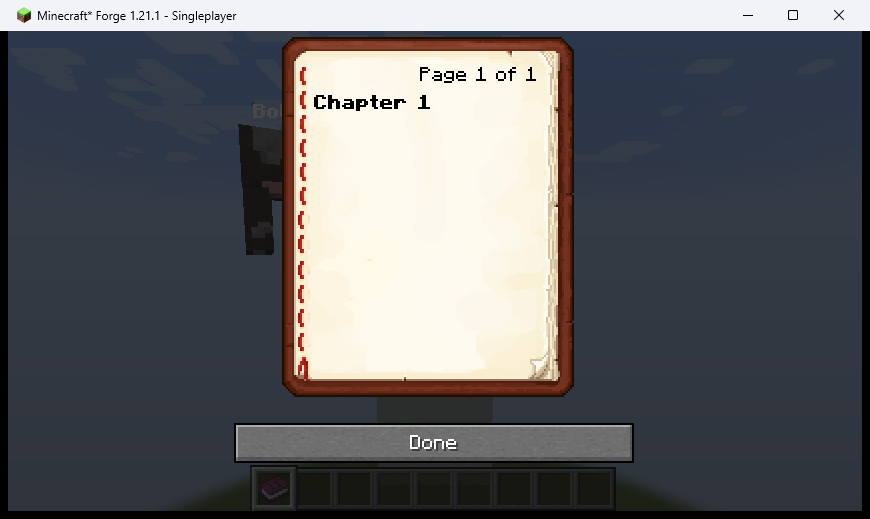
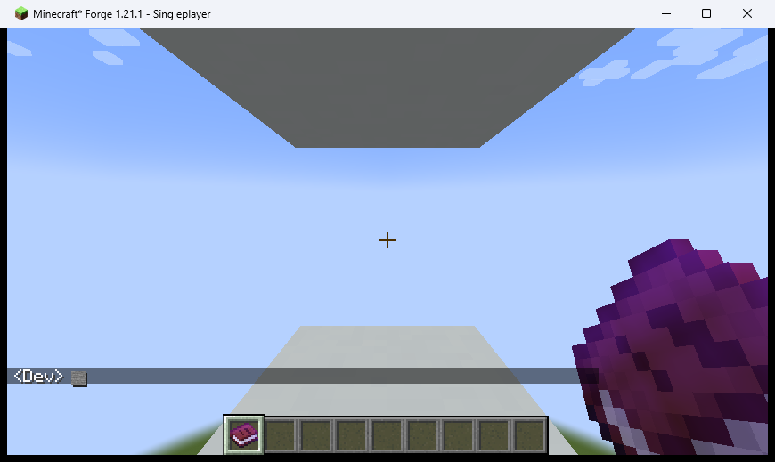
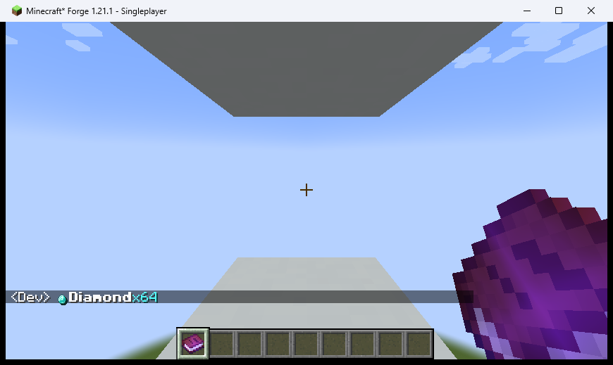
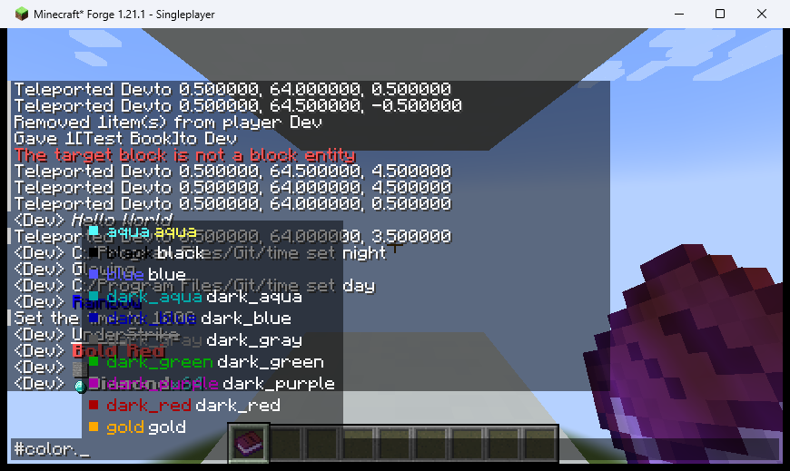
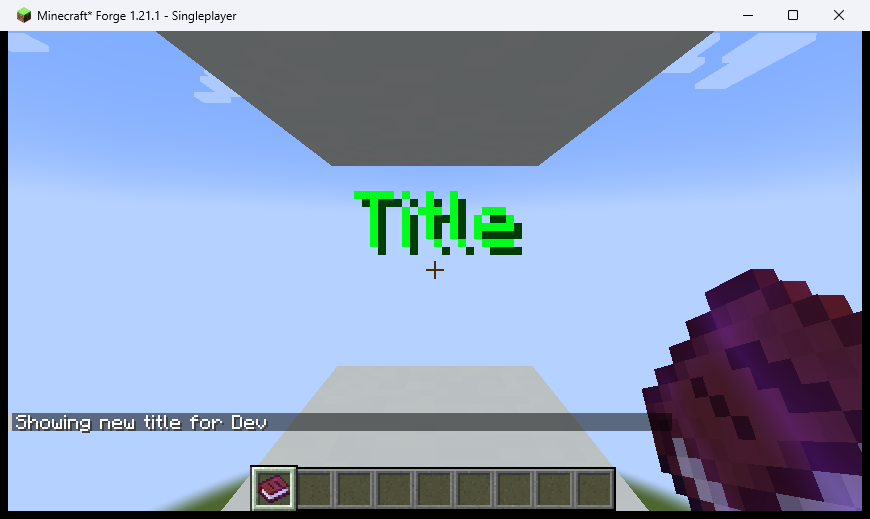

# QA Evidence — 2026-05-18

**ブランチ**: 1.21.1
**コミット**: 0cca96b
**Minecraft / Forge**: 1.21.1

## 結果サマリー

合計 15件 / ✅ PASS: 13件 / ❌ FAIL: 1件 / ⚠ N/A: 1件

| # | テストケース | 機能 | 結果 |
|---|---|---|---|
| 1 | TC-BOOK-01 | Written Book リッチテキスト (`MixinWrittenBookAccess`) | ✅ PASS |
| 2 | TC-CHAT italic | デコレータ `#italic` | ✅ PASS |
| 3 | TC-CHAT glow | デコレータ `#glow` | ✅ PASS |
| 4 | TC-CHAT rainbow | デコレータ `#rainbow` | ✅ PASS |
| 5 | TC-CHAT underline/strike | デコレータ `#underline` `#strike` | ✅ PASS |
| 6 | TC-CHAT ネスト | `#bold[#color.red[...]]` | ✅ PASS |
| 7 | TC-CHAT ブロックスプライト | `:block.stone:` | ✅ PASS |
| 8 | TC-CHAT 複合 | スプライト + デコレータ混在 | ✅ PASS |
| 9 | TC-AUTO color args | `#color.` 引数候補 | ✅ PASS |
| 10 | TC-AUTO item args | `:item.` 引数候補 | ⚠ N/A（`item.json` に `suggestions` 未定義） |
| 11 | TC-GUI actionbar | アクションバー `#color.gold` | ✅ PASS |
| 12 | TC-GUI title | タイトル `#rainbow` | ❌ FAIL（`toComponent()` 経路で動的色が失われる） |
| 13 | TC-TOOLTIP hover | ホバーツールチップ `#bold#color.aqua` | ✅ PASS |
| 14 | TC-SIGN sprite | 看板 `:item.diamond:` | ✅ PASS |
| 15 | TC-GRAFFITI glow | Graffiti 暗所発光 `#glow` | ✅ PASS |

## 本日のバグ修正

### MixinWrittenBookAccess — Mojang マッピング名対応
`@Redirect` の target で SRG 名 (`m_98310_`) を使っていたが、Forge 1.21.1 では Mojang 名 (`getPage`) で参照する必要があった。`require=0` によりサイレント失敗していたため書籍でリッチテキストが無効だった。

### スプライトグリフ縦位置（up=1f→7f）
前回 `up=3f→1f` で改善したが不十分だった。MC デフォルトフォントの ascent=7 に合わせて `up=7f` に修正。

## スクリーンショット

### TC-BOOK-01 — Written Book リッチテキスト

> `#bold[Chapter 1]` が太字で描画されている。`MixinWrittenBookAccess` の Mojang マッピング修正後に PASS。

### TC-CHAT italic

> `#italic[Hello World]` が斜体で描画されている。

### TC-CHAT rainbow

> `#rainbow[Rainbow]` が虹色グラデーションで描画されている。

### TC-CHAT ネスト

> `#bold[#color.red[Bold Red]]` が太字かつ赤色で描画されている。

### TC-CHAT ブロックスプライト

> `:block.stone:` がスプライトアイコンとして描画されている。

### TC-CHAT 複合

> `:item.diamond:` アイコン + 太字 "Diamond" + アクア "x64" が混在表示されている。

### TC-AUTO color args

> `#color.` 入力後に色名候補（各色プレビュー付き）が表示されている。

### TC-GUI actionbar

> アクションバーに金色の "Action Bar" が表示されている。

### TC-GUI title（FAIL）

> `#rainbow` が緑単色になっている。`toComponent()` 経路では動的アニメーション色が静的 Component に変換時に失われる（設計上の既知制限）。

### TC-TOOLTIP hover

> ホバーツールチップのアイテム名に太字アクア色 "Diamond" が表示されている。

### TC-SIGN sprite

> 看板に `:item.diamond:` スプライトが描画されている。

### TC-GRAFFITI glow

> 暗所（深夜）で "GLOW" テキストが発光して明るく表示されている。
