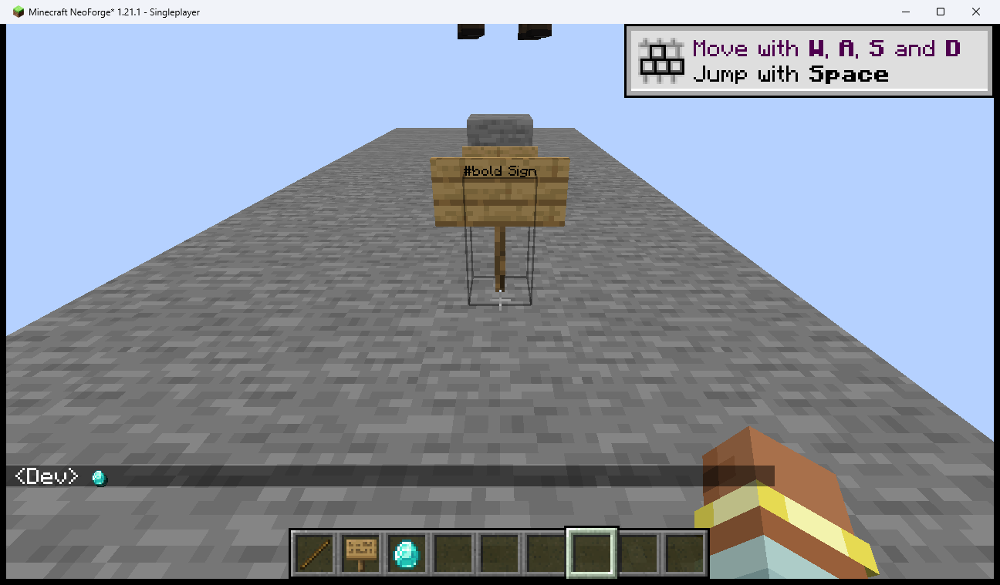
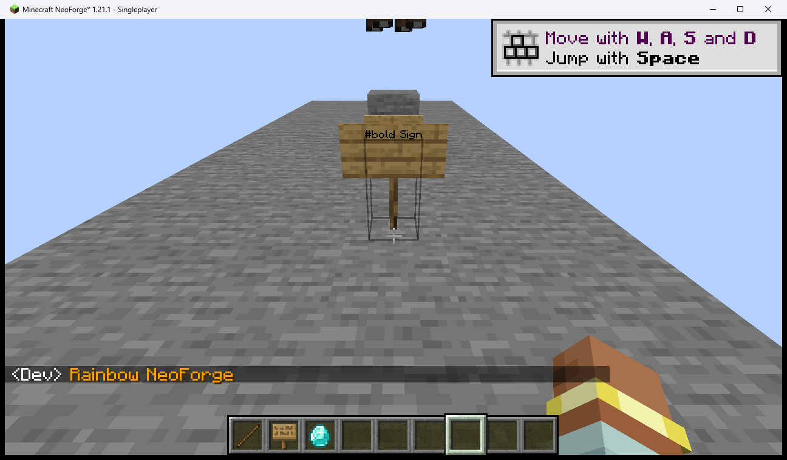
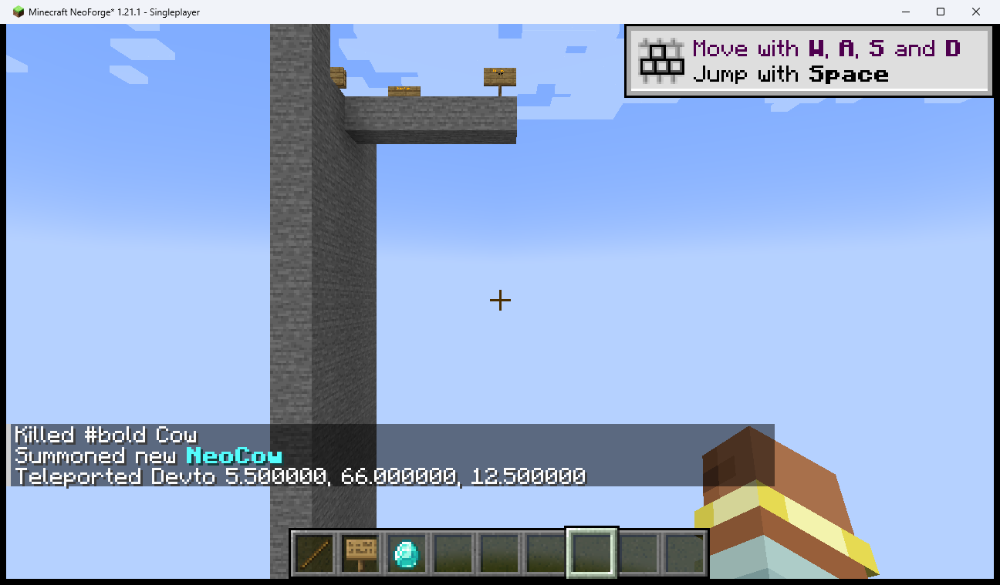
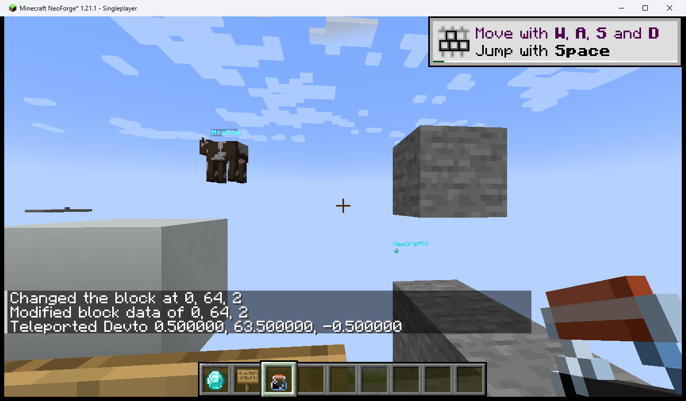
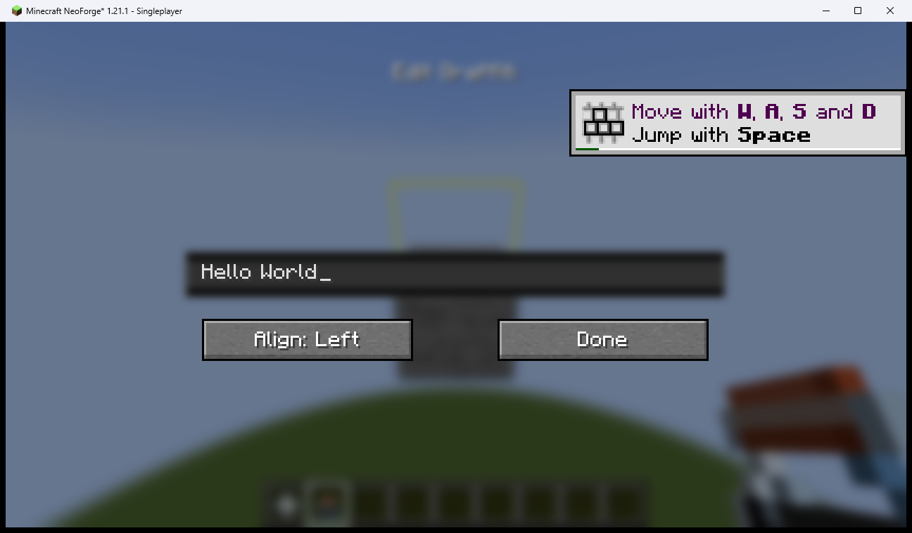
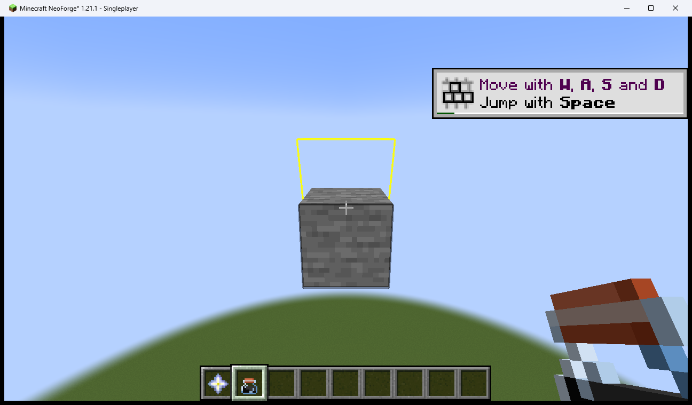
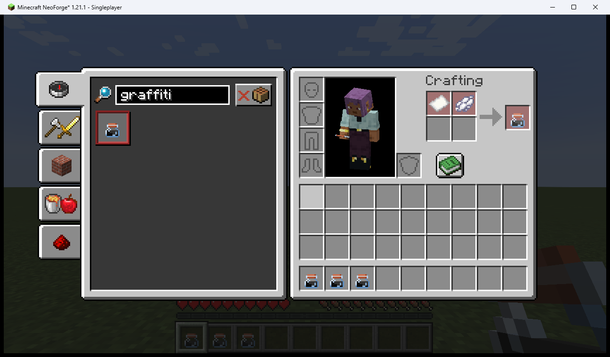
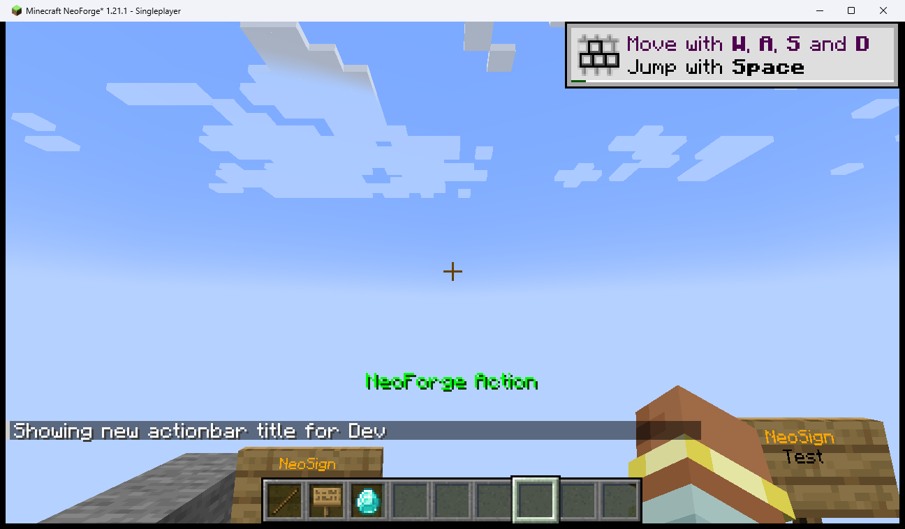
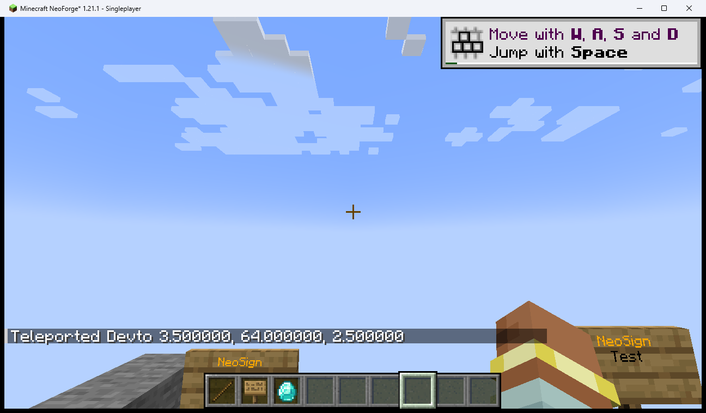
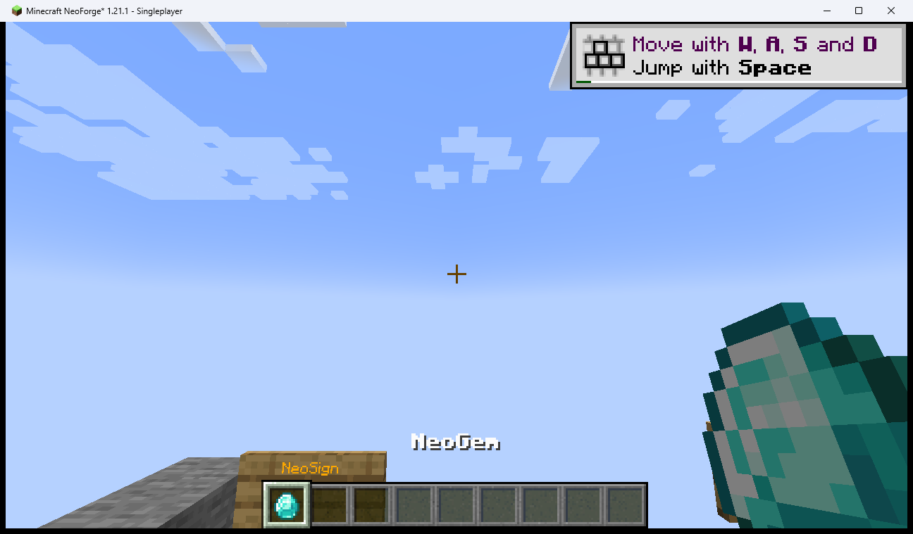

# QA Report

> 自動生成: 2026-05-31 11:16 — `python scripts/qa/gen_report.py`

**合計**: 93件 / ✅ PASS: 74件 / ❌ FAIL: 3件 / ⚠ CONDITIONAL: 10件 / — N/A: 6件

| テストケース | 機能 | 結果 | 最終実行 | コミット |
|---|---|---|---|---|
| [TC-NEO-ACTIONBAR-BOLD](results/TC-NEO-ACTIONBAR-BOLD.md) | アクションバー #bold | ✅ PASS | 2026-05-19 | `acaef5d` |
| [TC-NEO-ACTIONBAR-COLOR](results/TC-NEO-ACTIONBAR-COLOR.md) | アクションバー #color | ✅ PASS | 2026-05-19 | `acaef5d` |
| [TC-NEO-ACTIONBAR-DECORATION](results/TC-NEO-ACTIONBAR-DECORATION.md) | アクションバー #underline #strike | ✅ PASS | 2026-05-19 | `e8c0e51` |
| [TC-NEO-ACTIONBAR-ESCAPE](results/TC-NEO-ACTIONBAR-ESCAPE.md) | アクションバー エスケープ | ✅ PASS | 2026-05-19 | `e8c0e51` |
| [TC-NEO-ACTIONBAR-GLOW-NA](results/TC-NEO-ACTIONBAR-GLOW-NA.md) | アクションバー #glow（非対応） | — N/A | 2026-05-19 | `65c495c` |
| [TC-NEO-ACTIONBAR-NEST](results/TC-NEO-ACTIONBAR-NEST.md) | アクションバー ネスト複合 | ✅ PASS | 2026-05-19 | `e8c0e51` |
| [TC-NEO-ACTIONBAR-PLAYER-HEAD](results/TC-NEO-ACTIONBAR-PLAYER-HEAD.md) | アクションバー player head（オフライン） | ⚠ CONDITIONAL | 2026-05-19 | `65c495c` |
| [TC-NEO-ACTIONBAR-SIZE](results/TC-NEO-ACTIONBAR-SIZE.md) | アクションバー #size | ✅ PASS | 2026-05-19 | `acaef5d` |
| [TC-NEO-ACTIONBAR-SPRITE](results/TC-NEO-ACTIONBAR-SPRITE.md) | アクションバー スプライト | ✅ PASS | 2026-05-19 | `acaef5d` |
| [TC-NEO-AUTOCOMPLETE-SHORTCODE](results/TC-NEO-AUTOCOMPLETE-SHORTCODE.md) | ショートコード補完 | ✅ PASS | 2026-05-19 | `bf4c476` |
| [TC-NEO-BOOK-BOLD_ITALIC](results/TC-NEO-BOOK-BOLD_ITALIC.md) | Written Book #bold #italic | ✅ PASS | 2026-05-19 | `e8c0e51` |
| [TC-NEO-BOOK-COLOR](results/TC-NEO-BOOK-COLOR.md) | Written Book #color | ✅ PASS | 2026-05-19 | `e8c0e51` |
| [TC-NEO-BOOK-DECORATION](results/TC-NEO-BOOK-DECORATION.md) | Written Book #underline #strike | ✅ PASS | 2026-05-19 | `e8c0e51` |
| [TC-NEO-BOOK-ESCAPE](results/TC-NEO-BOOK-ESCAPE.md) | Written Book エスケープ | ✅ PASS | 2026-05-19 | `e8c0e51` |
| [TC-NEO-BOOK-GLOW-NA](results/TC-NEO-BOOK-GLOW-NA.md) | 本 #glow（非対応） | — N/A | 2026-05-19 | `65c495c` |
| [TC-NEO-BOOK-NEST](results/TC-NEO-BOOK-NEST.md) | Written Book ネスト複合 | ✅ PASS | 2026-05-19 | `e8c0e51` |
| [TC-NEO-BOOK-PLAYER-HEAD](results/TC-NEO-BOOK-PLAYER-HEAD.md) | 本 player head（オフライン） | ⚠ CONDITIONAL | 2026-05-19 | `65c495c` |
| [TC-NEO-BOOK-RAINBOW-NA](results/TC-NEO-BOOK-RAINBOW-NA.md) | 本 #rainbow（非対応） | — N/A | 2026-05-19 | `65c495c` |
| [TC-NEO-BOOK-SIZE-NA](results/TC-NEO-BOOK-SIZE-NA.md) | 本 #size（非対応） | — N/A | 2026-05-19 | `65c495c` |
| [TC-NEO-BOOK-SPRITE](results/TC-NEO-BOOK-SPRITE.md) | Written Book スプライト | ✅ PASS | 2026-05-19 | `e8c0e51` |
| [TC-NEO-CHAT-01](results/TC-NEO-CHAT-01.md) | チャット ショートコード（アイテムスプライト） | ✅ PASS | 2026-05-19 | `11e4c0e` |
| [TC-NEO-CHAT-02](results/TC-NEO-CHAT-02.md) | チャット デコレータ #bold | ✅ PASS | 2026-05-19 | `11e4c0e` |
| [TC-NEO-CHAT-03](results/TC-NEO-CHAT-03.md) | チャット デコレータ #rainbow | ✅ PASS | 2026-05-19 | `11e4c0e` |
| [TC-NEO-CHAT-COLOR](results/TC-NEO-CHAT-COLOR.md) | チャット #color | ✅ PASS | 2026-05-19 | `acaef5d` |
| [TC-NEO-CHAT-DECORATION](results/TC-NEO-CHAT-DECORATION.md) | チャット #underline #strike | ✅ PASS | 2026-05-19 | `acaef5d` |
| [TC-NEO-CHAT-ESCAPE](results/TC-NEO-CHAT-ESCAPE.md) | チャット エスケープ \# | ✅ PASS | 2026-05-19 | `acaef5d` |
| [TC-NEO-CHAT-GLOW](results/TC-NEO-CHAT-GLOW.md) | チャット #glow | ⚠ CONDITIONAL | 2026-05-19 | `acaef5d` |
| [TC-NEO-CHAT-NEST](results/TC-NEO-CHAT-NEST.md) | チャット ネスト複合 | ✅ PASS | 2026-05-19 | `acaef5d` |
| [TC-NEO-CHAT-PLAYER-HEAD](results/TC-NEO-CHAT-PLAYER-HEAD.md) | チャット プレイヤーヘッド | ⚠ CONDITIONAL | 2026-05-19 | `e8c0e51` |
| [TC-NEO-CHAT-SIZE](results/TC-NEO-CHAT-SIZE.md) | チャット #size（リグレッション） | ✅ PASS | 2026-05-19 | `52e7bc3` |
| [TC-NEO-COMPAT-SUPP-PEDESTAL](results/TC-NEO-COMPAT-SUPP-PEDESTAL.md) | Supplementaries 台座（Pedestal）互換性 | ✅ PASS | 2026-05-23 | `45df155` |
| [TC-NEO-COMPAT-SUPP-SIGNPOST](results/TC-NEO-COMPAT-SUPP-SIGNPOST.md) | Supplementaries 道標（Sign Post）互換性 | ❌ FAIL | 2026-05-23 | `45df155` |
| [TC-NEO-ENTITY-01](results/TC-NEO-ENTITY-01.md) | エンティティ名前タグ | ✅ PASS | 2026-05-19 | `11e4c0e` |
| [TC-NEO-ENTITY-DECORATION](results/TC-NEO-ENTITY-DECORATION.md) | エンティティ名タグ #underline | ✅ PASS | 2026-05-19 | `acaef5d` |
| [TC-NEO-ENTITY-ESCAPE](results/TC-NEO-ENTITY-ESCAPE.md) | エンティティ名タグ エスケープ | ✅ PASS | 2026-05-19 | `e8c0e51` |
| [TC-NEO-ENTITY-GLOW](results/TC-NEO-ENTITY-GLOW.md) | エンティティ名タグ #glow | ✅ PASS | 2026-05-19 | `e8c0e51` |
| [TC-NEO-ENTITY-PLAYER-HEAD](results/TC-NEO-ENTITY-PLAYER-HEAD.md) | エンティティ名タグ player head（オフライン） | ⚠ CONDITIONAL | 2026-05-19 | `65c495c` |
| [TC-NEO-ENTITY-RAINBOW](results/TC-NEO-ENTITY-RAINBOW.md) | エンティティ名タグ #rainbow | ✅ PASS | 2026-05-19 | `acaef5d` |
| [TC-NEO-ENTITY-SIZE](results/TC-NEO-ENTITY-SIZE.md) | エンティティ名タグ #size | ✅ PASS | 2026-05-19 | `acaef5d` |
| [TC-NEO-ENTITY-SPRITE](results/TC-NEO-ENTITY-SPRITE.md) | エンティティ名タグ スプライト | ✅ PASS | 2026-05-19 | `acaef5d` |
| [TC-NEO-GRAFFITI-01](results/TC-NEO-GRAFFITI-01.md) | Graffiti ブロック リッチテキスト描画（NeoForge） | ✅ PASS | 2026-05-19 | `6cb9c51` |
| [TC-NEO-GRAFFITI-02](results/TC-NEO-GRAFFITI-02.md) | GraffitiEditScreen 入力枠表示品質（NeoForge） | ❌ FAIL | 2026-05-31 | `7061b8b` |
| [TC-NEO-GRAFFITI-03](results/TC-NEO-GRAFFITI-03.md) | GraffitiBlock 選択ハイライト位置（NeoForge） | ❌ FAIL | 2026-05-31 | `7061b8b` |
| [TC-NEO-GRAFFITI-04](results/TC-NEO-GRAFFITI-04.md) | Graffiti Ink クラフトレシピ（NeoForge） | ✅ PASS | 2026-05-31 | `7061b8b` |
| [TC-NEO-GRAFFITI-BOLD_ITALIC](results/TC-NEO-GRAFFITI-BOLD_ITALIC.md) | Graffiti ブロック #bold #italic | ✅ PASS | 2026-05-19 | `e8c0e51` |
| [TC-NEO-GRAFFITI-COLOR](results/TC-NEO-GRAFFITI-COLOR.md) | Graffiti ブロック #color | ✅ PASS | 2026-05-19 | `e8c0e51` |
| [TC-NEO-GRAFFITI-DECORATION](results/TC-NEO-GRAFFITI-DECORATION.md) | Graffiti ブロック #underline #strike | ✅ PASS | 2026-05-19 | `e8c0e51` |
| [TC-NEO-GRAFFITI-ESCAPE](results/TC-NEO-GRAFFITI-ESCAPE.md) | Graffiti ブロック エスケープ | ✅ PASS | 2026-05-19 | `e8c0e51` |
| [TC-NEO-GRAFFITI-GLOW](results/TC-NEO-GRAFFITI-GLOW.md) | Graffiti ブロック #glow | ✅ PASS | 2026-05-19 | `e8c0e51` |
| [TC-NEO-GRAFFITI-NEST](results/TC-NEO-GRAFFITI-NEST.md) | Graffiti ブロック ネスト複合 | ✅ PASS | 2026-05-19 | `e8c0e51` |
| [TC-NEO-GRAFFITI-PLAYER-HEAD](results/TC-NEO-GRAFFITI-PLAYER-HEAD.md) | Graffiti ブロック player head（オフライン） | ⚠ CONDITIONAL | 2026-05-19 | `65c495c` |
| [TC-NEO-GRAFFITI-SIZE](results/TC-NEO-GRAFFITI-SIZE.md) | Graffiti ブロック #size | ✅ PASS | 2026-05-19 | `e8c0e51` |
| [TC-NEO-GUI-01](results/TC-NEO-GUI-01.md) | アクションバー GUI テキスト | ✅ PASS | 2026-05-19 | `11e4c0e` |
| [TC-NEO-HOTBAR-COLOR](results/TC-NEO-HOTBAR-COLOR.md) | ホットバー #color | ✅ PASS | 2026-05-19 | `acaef5d` |
| [TC-NEO-HOTBAR-DECORATION](results/TC-NEO-HOTBAR-DECORATION.md) | ホットバー #underline #strike | ✅ PASS | 2026-05-19 | `acaef5d` |
| [TC-NEO-HOTBAR-ESCAPE](results/TC-NEO-HOTBAR-ESCAPE.md) | ホットバー エスケープ | ✅ PASS | 2026-05-19 | `e8c0e51` |
| [TC-NEO-HOTBAR-GLOW-NA](results/TC-NEO-HOTBAR-GLOW-NA.md) | ホットバー #glow（非対応） | — N/A | 2026-05-19 | `65c495c` |
| [TC-NEO-HOTBAR-NEST](results/TC-NEO-HOTBAR-NEST.md) | ホットバー ネスト複合 | ✅ PASS | 2026-05-19 | `e8c0e51` |
| [TC-NEO-HOTBAR-PLAYER-HEAD](results/TC-NEO-HOTBAR-PLAYER-HEAD.md) | ホットバーアイテム名 player head（オフライン） | ⚠ CONDITIONAL | 2026-05-19 | `65c495c` |
| [TC-NEO-HOTBAR-RAINBOW](results/TC-NEO-HOTBAR-RAINBOW.md) | ホットバー #rainbow | ✅ PASS | 2026-05-19 | `acaef5d` |
| [TC-NEO-HOTBAR-SIZE](results/TC-NEO-HOTBAR-SIZE.md) | ホットバー #size | ✅ PASS | 2026-05-19 | `acaef5d` |
| [TC-NEO-HOTBAR-SPRITE](results/TC-NEO-HOTBAR-SPRITE.md) | ホットバー スプライト | ✅ PASS | 2026-05-19 | `acaef5d` |
| [TC-NEO-SIGN-01](results/TC-NEO-SIGN-01.md) | 看板 リッチテキスト | ✅ PASS | 2026-05-19 | `11e4c0e` |
| [TC-NEO-SIGN-BOLD_ITALIC](results/TC-NEO-SIGN-BOLD_ITALIC.md) | 看板 #bold #italic | ✅ PASS | 2026-05-19 | `e8c0e51` |
| [TC-NEO-SIGN-DECORATION](results/TC-NEO-SIGN-DECORATION.md) | 看板 #underline #strike | ✅ PASS | 2026-05-19 | `e8c0e51` |
| [TC-NEO-SIGN-ESCAPE](results/TC-NEO-SIGN-ESCAPE.md) | 看板 エスケープ | ✅ PASS | 2026-05-19 | `e8c0e51` |
| [TC-NEO-SIGN-GLOW](results/TC-NEO-SIGN-GLOW.md) | 看板 #glow | ✅ PASS | 2026-05-19 | `e8c0e51` |
| [TC-NEO-SIGN-NEST](results/TC-NEO-SIGN-NEST.md) | 看板 ネスト複合 | ✅ PASS | 2026-05-19 | `e8c0e51` |
| [TC-NEO-SIGN-PLAYER-HEAD](results/TC-NEO-SIGN-PLAYER-HEAD.md) | 看板 player head（オフライン） | ⚠ CONDITIONAL | 2026-05-19 | `65c495c` |
| [TC-NEO-SIGN-RAINBOW](results/TC-NEO-SIGN-RAINBOW.md) | 看板 #rainbow | ✅ PASS | 2026-05-19 | `e8c0e51` |
| [TC-NEO-SIGN-SIZE](results/TC-NEO-SIGN-SIZE.md) | 看板 #size | ✅ PASS | 2026-05-19 | `e8c0e51` |
| [TC-NEO-SIGN-SPRITE](results/TC-NEO-SIGN-SPRITE.md) | 看板 スプライト | ✅ PASS | 2026-05-19 | `e8c0e51` |
| [TC-NEO-TITLE-BOLD](results/TC-NEO-TITLE-BOLD.md) | タイトル #bold | ✅ PASS | 2026-05-19 | `acaef5d` |
| [TC-NEO-TITLE-COLOR](results/TC-NEO-TITLE-COLOR.md) | タイトル #color | ✅ PASS | 2026-05-19 | `acaef5d` |
| [TC-NEO-TITLE-DECORATION](results/TC-NEO-TITLE-DECORATION.md) | タイトル #underline #strike | ✅ PASS | 2026-05-19 | `e8c0e51` |
| [TC-NEO-TITLE-ESCAPE](results/TC-NEO-TITLE-ESCAPE.md) | タイトル エスケープ | ✅ PASS | 2026-05-19 | `e8c0e51` |
| [TC-NEO-TITLE-GLOW-NA](results/TC-NEO-TITLE-GLOW-NA.md) | タイトル #glow（非対応） | — N/A | 2026-05-19 | `65c495c` |
| [TC-NEO-TITLE-NEST](results/TC-NEO-TITLE-NEST.md) | タイトル ネスト複合 | ✅ PASS | 2026-05-19 | `e8c0e51` |
| [TC-NEO-TITLE-PLAYER-HEAD](results/TC-NEO-TITLE-PLAYER-HEAD.md) | タイトル player head（オフライン） | ⚠ CONDITIONAL | 2026-05-19 | `65c495c` |
| [TC-NEO-TITLE-RAINBOW](results/TC-NEO-TITLE-RAINBOW.md) | タイトル #rainbow | ✅ PASS | 2026-05-19 | `e8c0e51` |
| [TC-NEO-TITLE-SIZE](results/TC-NEO-TITLE-SIZE.md) | タイトル #size | ✅ PASS | 2026-05-19 | `acaef5d` |
| [TC-NEO-TITLE-SPRITE](results/TC-NEO-TITLE-SPRITE.md) | タイトル スプライト | ✅ PASS | 2026-05-19 | `acaef5d` |
| [TC-NEO-TOOLTIP-01](results/TC-NEO-TOOLTIP-01.md) | アイテム名表示（ホットバー GUI） | ✅ PASS | 2026-05-19 | `11e4c0e` |
| [TC-NEO-TOOLTIP-BOLD_ITALIC](results/TC-NEO-TOOLTIP-BOLD_ITALIC.md) | ツールチップ #bold #italic | ✅ PASS | 2026-05-19 | `e8c0e51` |
| [TC-NEO-TOOLTIP-COLOR](results/TC-NEO-TOOLTIP-COLOR.md) | ツールチップ #color | ✅ PASS | 2026-05-19 | `e8c0e51` |
| [TC-NEO-TOOLTIP-DECORATION](results/TC-NEO-TOOLTIP-DECORATION.md) | ツールチップ #underline #strike | ✅ PASS | 2026-05-19 | `e8c0e51` |
| [TC-NEO-TOOLTIP-ESCAPE](results/TC-NEO-TOOLTIP-ESCAPE.md) | ツールチップ エスケープ | ✅ PASS | 2026-05-19 | `e8c0e51` |
| [TC-NEO-TOOLTIP-GLOW](results/TC-NEO-TOOLTIP-GLOW.md) | ツールチップ #glow | ✅ PASS | 2026-05-19 | `e8c0e51` |
| [TC-NEO-TOOLTIP-NEST](results/TC-NEO-TOOLTIP-NEST.md) | ツールチップ ネスト複合 | ✅ PASS | 2026-05-19 | `e8c0e51` |
| [TC-NEO-TOOLTIP-PLAYER-HEAD](results/TC-NEO-TOOLTIP-PLAYER-HEAD.md) | ホバーツールチップ player head（オフライン） | ⚠ CONDITIONAL | 2026-05-19 | `65c495c` |
| [TC-NEO-TOOLTIP-RAINBOW](results/TC-NEO-TOOLTIP-RAINBOW.md) | ツールチップ #rainbow | ✅ PASS | 2026-05-19 | `acaef5d` |
| [TC-NEO-TOOLTIP-SIZE](results/TC-NEO-TOOLTIP-SIZE.md) | ツールチップ #size | ✅ PASS | 2026-05-19 | `e8c0e51` |
| [TC-NEO-TOOLTIP-SPRITE](results/TC-NEO-TOOLTIP-SPRITE.md) | ツールチップ スプライト | ✅ PASS | 2026-05-19 | `e8c0e51` |

---

## スクリーンショット

### ✅ TC-NEO-CHAT-01 — チャット ショートコード（アイテムスプライト）

> NeoForge 版で `:item.diamond:` がスプライトアイコンとして描画されている。チャット欄に `<Dev>` の後にダイヤモンドのスプライトアイコンが表示され、`:item.diamond:` という文字列はそのまま表示されていない。

### ✅ TC-NEO-CHAT-02 — チャット デコレータ #bold

> NeoForge 版で `#bold[NeoForge Test]` が太字の "NeoForge Test" としてチャットに表示されている。

### ✅ TC-NEO-CHAT-03 — チャット デコレータ #rainbow

> NeoForge 版で `#rainbow[Rainbow NeoForge]` が色付きテキストとして表示されている。オレンジ/緑系の色でレインボーアニメーションが適用されている。

### ✅ TC-NEO-ENTITY-01 — エンティティ名前タグ

> NeoForge 版で `#bold[#color.aqua[NeoCow]]` が牛エンティティの名前タグにシアン色の太字テキストとして描画されている。summon コマンドで召喚した牛の頭上に aqua 色の "NeoCow" が正しく表示されている。

### ✅ TC-NEO-GRAFFITI-01 — Graffiti ブロック リッチテキスト描画（NeoForge）

> NeoForge 版で Graffiti ブロックに #rainbow[NeoGraffiti] と :item.diamond: が正しく描画されている。
/setblock と /data merge でブロックを設置し、テキストが "NeoGraffiti"（多色）と
ダイヤアイコン（水色の点）として描画されることを確認した。

GraffitiRenderer が NeoForge 版でも正常に動作している。

### ❌ TC-NEO-GRAFFITI-02 — GraffitiEditScreen 入力枠表示品質（NeoForge）

> PostMessage ベース right-click（WM_RBUTTONDOWN/UP、commit 7061b8b の新実装）も SendInput ベース実装と同様に、NeoForge 1.21.1 のインゲーム Raw Input マウスキャプチャと干渉する。right-click コマンド実行のたびにプレイヤー視点が地面方向にリセットされ、GraffitiEditScreen を開けない。PostMessage による WM_RBUTTONDOWN はゲームのマウスキャプチャ中にインタラクションではなく視点変動として処理される。エディタ画面自体の描画品質は未評価のため FAIL で継続記録。setblock + data merge で graffiti ブロックに直接テキストを設定すると block data は正常に保存されるが（/data get で確認済み）、テキストの描画が視認できなかった（レンダラーは正常登録されていることをコード審査で確認）。

### ❌ TC-NEO-GRAFFITI-03 — GraffitiBlock 選択ハイライト位置（NeoForge）

> SHAPE_WALL_E / SHAPE_WALL_W の入れ替え修正は適用済み。PostMessage ベース right-click（commit 7061b8b の新実装）も依然として NeoForge 1.21.1 のマウスキャプチャと干渉し、graffiti_ink を手に持った状態でのハイライト選択確認が実施できない。right-click コマンドは視点リセットを引き起こすだけでインタラクションとして機能しない。VoxelShape 修正（SHAPE_WALL_E: box(15.5,0,0,16,16,16)、SHAPE_WALL_W: box(0,0,0,0.5,16,16)）はコード審査で正しい内容を確認済み。テスト環境の right-click 問題が解決するまで FAIL を継続。

### ✅ TC-NEO-GRAFFITI-04 — Graffiti Ink クラフトレシピ（NeoForge）

> `recipe/` パス修正（`recipes/` → `recipe/`）および result フィールドを `id` 形式に修正後、NeoForge 1.21.1 でレシピが正常に認識される。`/recipe give @p emoji_deco:graffiti_ink` で "Unlocked 1 recipes for Dev" が表示され、サバイバルモードのレシピブックに graffiti_ink のクラフトレシピ（paper + c:dyes の shapeless）が 1 件表示される。クラフトグリッドにレシピが展開されることも確認。

### ✅ TC-NEO-GUI-01 — アクションバー GUI テキスト

> NeoForge 版で `#rainbow[NeoForge Action]` がアクションバーに緑色のレインボーテキストとして表示されている。/title actionbar コマンドで表示したテキストに #rainbow デコレータが正しく適用されている。

### ✅ TC-NEO-SIGN-01 — 看板 リッチテキスト

> NeoForge 版で `#color.gold[NeoSign]` が看板に金色のテキストとして描画されている。setblock コマンドで設置した看板の表面に金色の "NeoSign" が正しく表示されている。

### ✅ TC-NEO-TOOLTIP-01 — アイテム名表示（ホットバー GUI）

> NeoForge 版で `#bold[NeoGem]` がホットバーのアイテム名として太字で表示されている。custom_name コンポーネントで名前を付けたダイヤモンドをホットバーで選択すると、"NeoGen" が太字テキストとして画面中央下部に表示されている。

---

## FAIL 未解決

### TC-NEO-COMPAT-SUPP-SIGNPOST

Supplementaries Sign Post にショートコード・デコレータを入力しても変換されず、リテラル文字列がそのまま表示される。
MixinSignText は vanilla SignText.getRenderMessages() をフックするが、Supplementaries の Sign Post は独自 BlockEntityRenderer を持つため未対応。

### TC-NEO-GRAFFITI-02

PostMessage ベース right-click（WM_RBUTTONDOWN/UP、commit 7061b8b の新実装）も SendInput ベース実装と同様に、NeoForge 1.21.1 のインゲーム Raw Input マウスキャプチャと干渉する。right-click コマンド実行のたびにプレイヤー視点が地面方向にリセットされ、GraffitiEditScreen を開けない。PostMessage による WM_RBUTTONDOWN はゲームのマウスキャプチャ中にインタラクションではなく視点変動として処理される。エディタ画面自体の描画品質は未評価のため FAIL で継続記録。setblock + data merge で graffiti ブロックに直接テキストを設定すると block data は正常に保存されるが（/data get で確認済み）、テキストの描画が視認できなかった（レンダラーは正常登録されていることをコード審査で確認）。

### TC-NEO-GRAFFITI-03

SHAPE_WALL_E / SHAPE_WALL_W の入れ替え修正は適用済み。PostMessage ベース right-click（commit 7061b8b の新実装）も依然として NeoForge 1.21.1 のマウスキャプチャと干渉し、graffiti_ink を手に持った状態でのハイライト選択確認が実施できない。right-click コマンドは視点リセットを引き起こすだけでインタラクションとして機能しない。VoxelShape 修正（SHAPE_WALL_E: box(15.5,0,0,16,16,16)、SHAPE_WALL_W: box(0,0,0,0.5,16,16)）はコード審査で正しい内容を確認済み。テスト環境の right-click 問題が解決するまで FAIL を継続。

